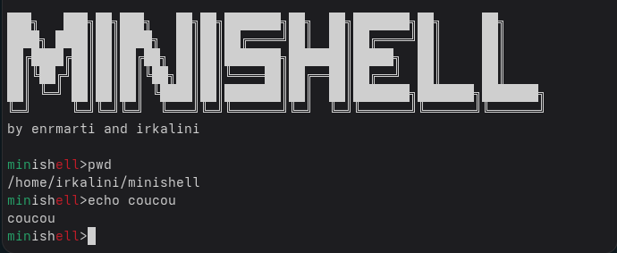

*This project has been created as part of the 42 curriculum by enrmarti* *and* *irkalini.*

# Minishell

## Description

Minishell is a custom implementation of a Unix command-line interpreter inspired by Bash.

The goal of the project is to understand how shells work internally by implementing command parsing, process creation, signal handling, environment management, pipes, and redirections.



---

## Instructions

Compile the project:

```bash
make
```

Run the shell:

```bash
./minishell
```

Prerequisites:

* Unix-like operating system (Linux, macOS)
* GCC compiler
* Make
* Readline library

---

## Features

### Command Parsing and Execution

* Parses command lines with arguments.
* Supports single quotes (`'`) and double quotes (`"`).
* Executes external commands found through the system `PATH`.

### Pipelines

* Supports command pipelines using the `|` operator.

### I/O Redirections

* `<` : redirect standard input.
* `>` : redirect standard output (truncate).
* `>>` : redirect standard output (append).

### Here Documents

* Supports here-documents using the `<<` operator.

### Environment Variable Expansion

* Expands environment variables such as `$USER` and `$PATH`.
* Supports special variables:

  * `$?` : last command exit status
  * `$$` : current process ID
  * `$UID` : user identifier

### Signal Handling

* `Ctrl+C` (`SIGINT`) displays a new prompt or interrupts the running process.
* `Ctrl+\` (`SIGQUIT`) is ignored in interactive mode and terminates running processes.
* `Ctrl+D` exits the shell.

### Built-in Commands

* `echo`
* `cd`
* `pwd`
* `export`
* `unset`
* `env`
* `exit`

---

## Available Makefile commands:

```bash
make
```

Compiles the project and creates the `minishell` executable.

```bash
make clean
```

Removes object files.

```bash
make fclean
```

Removes object files and the executable.

```bash
make re
```

Recompiles the project from scratch.

```bash
make valgrind
```

Runs the shell through Valgrind to detect memory leaks.

---

## Resources

### Technologies

* C
* GNU Readline
* POSIX System Calls
* Makefile
* Linux / Unix Environment

### Articles & Tutorials

* Bash Manual
* GNU Readline Documentation
* Linux Programmer's Manual (man pages)
* POSIX Shell Command Language Specification
* Advanced Programming in the UNIX Environment (Stevens & Rago)
* The Linux Programming Interface (Michael Kerrisk)

### AI Usage

AI was used to:

* Explain shell-related concepts and Unix process management.
* Review parsing and execution logic.
* Clarify signal handling behavior.
* Assist with debugging strategies and memory management.
* Improve project documentation.

The final implementation, architecture decisions, debugging, testing, and validation were completed manually.
